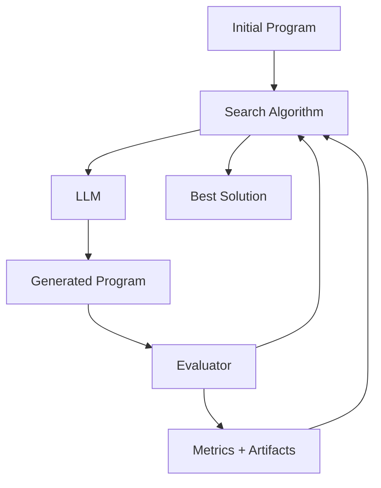

SkyDiscover is a modular framework for AI-driven scientific and algorithmic discovery. It provides a unified interface for implementing, running, and comparing discovery algorithms across diverse optimization tasks.

## What is SkyDiscover?

SkyDiscover enables you to use large language models (LLMs) to automatically discover and optimize:

- **Algorithms**: Sorting, scheduling, routing, packing problems
- **Mathematical solutions**: Geometric optimization, inequality proofs
- **System configurations**: GPU kernels, cloud scheduling, load balancing
- **Prompts**: Optimizing LLM prompts for specific tasks
- **Creative content**: AI image generation

<Info>
SkyDiscover has been validated across **200+ optimization tasks**, with its flagship algorithms AdaEvolve and EvoX achieving state-of-the-art results comparable to DeepMind's AlphaEvolve.
</Info>

## Core Components

SkyDiscover consists of four primary components that work together:



### 1. Initial Program (Optional)

The starting point for optimization. Can be:
- A baseline solution to improve upon
- Omitted entirely (LLM generates from scratch)
- Marked with `EVOLVE-BLOCK` markers to specify mutable regions

### 2. Search Algorithm

Determines **which** programs to evolve and **how** to evolve them. Options include:

- **AdaEvolve**: Multi-island adaptive search with UCB selection
- **EvoX**: Self-evolving search that co-adapts its own strategy
- **Top-K**: Simple refinement of top-performing solutions
- **Beam Search**: Breadth-first exploration of solution space
- **Best-of-N**: Multiple variants from the same parent

See [Search Algorithms](/concepts/algorithms) for details.

### 3. Evaluator

A Python function that scores candidate programs:

```python
def evaluate(program_path):
    score = run_and_grade(program_path)
    return {
        "combined_score": score,  # Primary optimization target
        "artifacts": {             # Optional feedback for LLM
            "feedback": "Off by one in loop boundary",
        },
    }
```

See [Evaluators](/concepts/evaluators) for examples.

### 4. LLM (Language Model)

Generates program mutations based on:
- Parent program
- Context programs (high-performing examples)
- Evaluation feedback from previous attempts
- Population statistics

Supports any [LiteLLM-compatible model](https://docs.litellm.ai/) including OpenAI, Anthropic, Google, and local models.

## The Discovery Loop

SkyDiscover runs this cycle for each iteration:

<Steps>
  <Step title="Sample">
    Search algorithm selects a parent program and context programs from the database
  </Step>
  
  <Step title="Prompt">
    Build prompts with parent code, context examples, feedback, and population stats
  </Step>
  
  <Step title="Generate">
    LLM creates a new program variant
  </Step>
  
  <Step title="Evaluate">
    Run the evaluator to score the program
  </Step>
  
  <Step title="Add">
    Store the program and metrics in the database
  </Step>
  
  <Step title="Adapt">
    Search algorithm updates its strategy based on results
  </Step>
</Steps>

This loop repeats for the configured number of iterations (typically 50-200).

## Key Design Principles

### Modularity

Every component is swappable:
- Try different search algorithms without changing your problem
- Use the same evaluator across multiple algorithms
- Switch LLM providers seamlessly

### Fairness

All algorithms run with:
- Same evaluation budget
- Same LLM calls per iteration
- Standardized prompt templates
- Reproducible checkpointing

### Extensibility

Easy to add new:
- Search algorithms (see `skydiscover/search/README.md:29`)
- Benchmarks (see `benchmarks/README.md`)
- Context builders for custom prompt strategies

## What Makes SkyDiscover Different?

<CardGroup cols={2}>
  <Card title="Adaptive Algorithms" icon="chart-line">
    AdaEvolve and EvoX dynamically adjust search intensity based on progress, unlike fixed strategies in other frameworks
  </Card>
  
  <Card title="200+ Benchmarks" icon="database">
    Comprehensive evaluation across math, systems, algorithms, and reasoning tasks
  </Card>
  
  <Card title="Native Implementations" icon="code">
    Built-in versions of OpenEvolve and GEPA for fair comparison without external dependencies
  </Card>
  
  <Card title="Real-time Monitoring" icon="eye">
    Live dashboard with scatter plots, code diffs, and human feedback integration
  </Card>
</CardGroup>

## Performance Highlights

Across ~200 optimization benchmarks:

- **Frontier-CS**: 34% median score improvement over OpenEvolve, GEPA, and ShinkaEvolve
- **Math + Systems**: Matches or exceeds AlphaEvolve and human SOTA on 12/14 tasks
- **Real-world impact**:
  - 41% lower cross-cloud transfer cost
  - 14% better GPU load balance for MoE serving
  - 29% lower KV-cache pressure via GPU model placement

## Next Steps

<CardGroup cols={2}>
  <Card title="Architecture" icon="sitemap" href="/concepts/architecture">
    Deep dive into SkyDiscover's internal architecture
  </Card>
  
  <Card title="Search Algorithms" icon="magnifying-glass" href="/concepts/algorithms">
    Learn about available search algorithms
  </Card>
  
  <Card title="Evaluators" icon="flask" href="/concepts/evaluators">
    Write effective evaluation functions
  </Card>
  
  <Card title="Evolution Blocks" icon="cube" href="/concepts/evolution-blocks">
    Control what code gets evolved
  </Card>
</CardGroup>