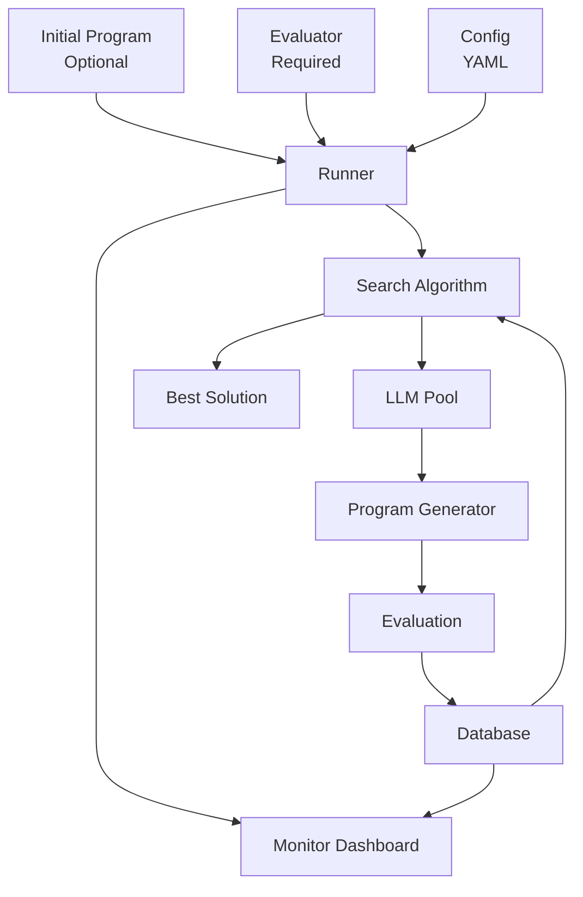

**SkyDiscover** is a modular framework for AI-driven scientific and algorithmic discovery, providing a unified interface for implementing, running, and fairly comparing discovery algorithms across 200+ optimization tasks.

## What is SkyDiscover?

SkyDiscover enables you to use LLMs to automatically discover and optimize solutions to complex problems—from circle packing and competitive programming challenges to GPU kernel optimization and cloud scheduling.

Instead of manually coding algorithms, you provide:
- An **evaluator function** that scores candidate solutions
- Optionally, an **initial program** to improve upon (or start from scratch)

SkyDiscover then uses adaptive evolutionary algorithms powered by frontier LLMs to iteratively improve your solution.

<Note>
SkyDiscover is under active development. New algorithms, benchmarks, and features are being added regularly.
</Note>

## Key Features

### State-of-the-Art Algorithms

SkyDiscover introduces two new adaptive optimization algorithms:

- **[AdaEvolve](https://arxiv.org/abs/2602.20133)** - Dynamically adjusts optimization behavior based on observed progress with multi-island search, UCB-based selection, and paradigm breakthroughs
- **[EvoX](https://arxiv.org/abs/2602.23413)** - Self-evolving paradigm that co-adapts solution generation and experience management using LLMs on the fly

These algorithms achieve ~34% median score improvement over OpenEvolve, GEPA, and ShinkaEvolve on the Frontier-CS benchmark (172 problems).

### Multiple Search Strategies

Choose from native algorithms:
- **AdaEvolve** - Multi-island adaptive search (recommended)
- **EvoX** - Self-evolving paradigm
- **Top-K** - Select and refine top-K solutions
- **Beam Search** - Breadth-first expansion
- **Best-of-N** - Generate N variants per iteration
- **OpenEvolve Native** - MAP-Elites + island-based search
- **GEPA Native** - Pareto-efficient search with reflective prompting

Or use external backends (requires `--extra external`):
- OpenEvolve
- GEPA
- ShinkaEvolve

### 200+ Benchmark Tasks

SkyDiscover includes diverse benchmarks across multiple domains:

| Domain | Benchmark | Tasks | Description |
|--------|-----------|-------|-------------|
| 🔢 Math | Circle packing, Erdos problems | 14 | Geometric optimization challenges |
| 🖥️ Systems | ADRS, GPU mode | 9 | Cloud scheduling, load balancing, kernel optimization |
| 🧩 Algorithms | Frontier-CS | 172 | Competitive programming challenges |
| 💻 Programming | ALE Bench | 10 | Algorithmic contests |
| 💬 NLP | Prompt optimization | 1 | HotPotQA prompt evolution |
| 🎨 Creative | Image generation | 1 | AI image generation evolution |

### Flexible Model Support

Works with any LiteLLM-compatible model:
- OpenAI (GPT-5, GPT-4o, etc.)
- Google (Gemini 2.0, Gemini 3 Pro)
- Anthropic (Claude)
- Local models (Ollama, vLLM)
- Multi-model pools with weighted sampling

### Live Monitoring & Human Feedback

Built-in dashboard for real-time progress tracking:
- Scatter plot of all generated programs
- Code diffs and metrics visualization
- AI-generated summaries
- Human feedback panel to steer evolution

### Modular & Extensible

Easy to extend with:
- Custom search algorithms
- New benchmarks
- Custom context builders
- Domain-specific prompts

## Architecture Overview

SkyDiscover follows a modular architecture with clear separation of concerns:

### Core Components

<Steps>
  <Step title="Initial Program (Optional)">
    Starting point for evolution. Can contain `EVOLVE-BLOCK` markers to specify regions to mutate. If omitted, the LLM generates solutions from scratch.
  </Step>
  
  <Step title="Evaluator (Required)">
    Python function that scores candidate solutions. Returns a dictionary with `combined_score` (maximized) and optional `artifacts` for contextual feedback.
  </Step>
  
  <Step title="Search Algorithm">
    Evolutionary strategy that selects which programs to mutate. Examples: AdaEvolve, EvoX, Beam Search, Top-K.
  </Step>
  
  <Step title="LLM Pool">
    One or more language models that generate program mutations. Supports weighted sampling across multiple models.
  </Step>
  
  <Step title="Database">
    Tracks all generated programs, scores, and metadata. Enables checkpointing and resume functionality.
  </Step>
  
  <Step title="Monitor (Optional)">
    Web-based dashboard for real-time visualization and human feedback.
  </Step>
</Steps>

## Real-World Impact

SkyDiscover has achieved significant improvements on real systems optimization tasks:

- **41% lower** cross-cloud transfer costs
- **14% better** GPU load balancing for MoE serving
- **29% lower** KV-cache pressure via optimized GPU model placement
- Matches or exceeds AlphaEvolve and human SOTA on 12/14 math and systems tasks

## Performance Benchmarks

Across ~200 optimization benchmarks:

- **Frontier-CS** (172 problems): ~34% median improvement over OpenEvolve, GEPA, ShinkaEvolve
- **Math tasks** (8 problems): Matches or exceeds AlphaEvolve on 6/8 tasks
- **Systems tasks** (6 problems): Matches or exceeds AlphaEvolve on all 6 tasks

<CardGroup cols={2}>
  <Card title="Quick Start" icon="rocket" href="/quickstart">
    Get started with your first discovery in under 5 minutes
  </Card>
  <Card title="Installation" icon="download" href="/installation">
    Detailed installation instructions and system requirements
  </Card>
  <Card title="API Reference" icon="code" href="/api/run-discovery">
    Complete Python API documentation
  </Card>
  <Card title="CLI Reference" icon="terminal" href="/cli/skydiscover-run">
    Command-line interface documentation
  </Card>
</CardGroup>

## Next Steps

<CardGroup cols={2}>
  <Card title="Try the Quickstart" icon="play" href="/quickstart">
    Run your first discovery problem with the circle packing example
  </Card>
  <Card title="View Benchmarks" icon="chart-bar" href="/guides/benchmarks">
    Explore the 200+ included benchmark tasks
  </Card>
</CardGroup>
